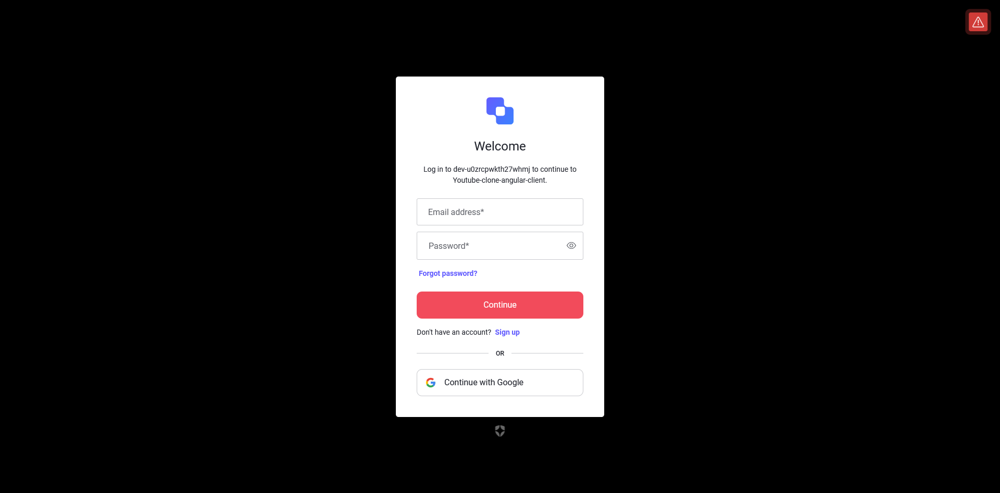
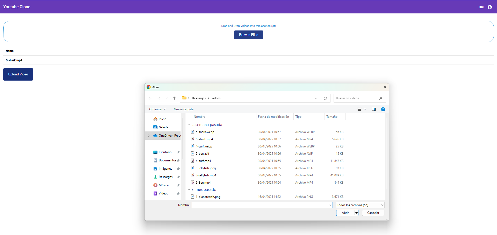
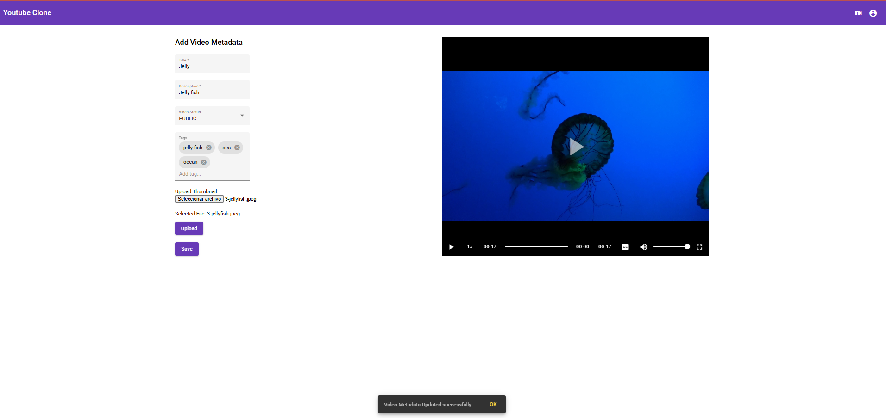
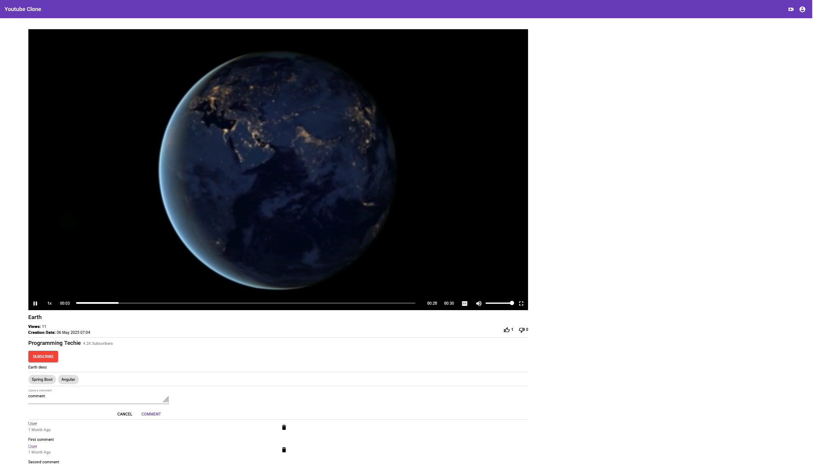
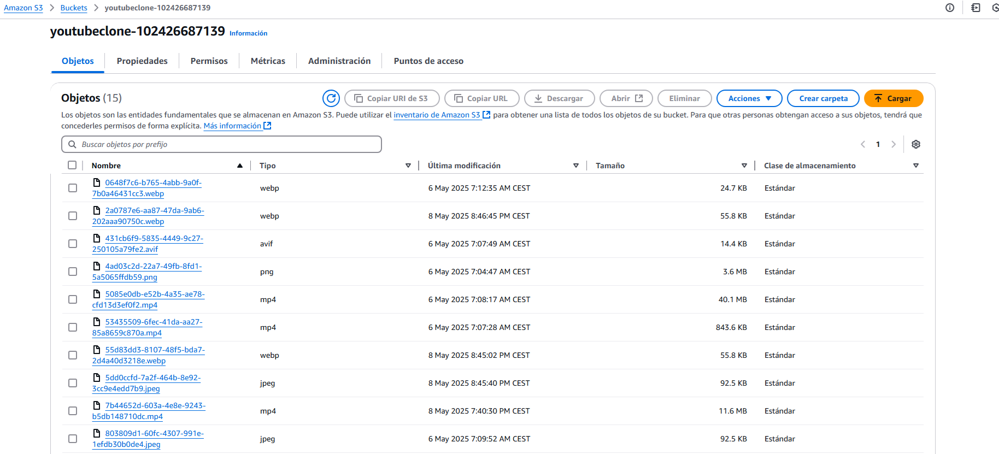

# YouTube Clone Application 💻

This is a basic full-stack YouTube clone application that allows users to upload, view, and interact with video content. It includes features such as authentication, video uploads to AWS S3, and metadata storage in Mongo db. Users can also subscribe / unsubscribe to users, like or dislike videos, and manage their video history and liked videos.

---

## Backend Repository 🔗

The backend of the application is built with Java Springboot and can be found at:

[Backend Repository - Springboot](https://github.com/PagarciaSima/Youtube-clone-Back)

---

## 🛠️ Features

- 🔐 Authentication with OAuth2 (Auth0)
- 🔑 JWT-based session management.
- 👍👎 Like and dislike videos.
- 📤 Upload videos and metadata / thumbnail to AWS S3.
- 🎥 Preview and play videos.
- ➕➖ Subscribe and unsubscribe from users.
- 📜 View all uploaded videos, watch history, and liked videos.
- 🗂️ List of all liked videos.
- Add / delete comments

---

## ⚙️ Technologies

### Backend (Spring Boot 3.4.0 / Java 17)
- **Spring Boot 3.4.0** (Main framework)
- **Spring Web** (REST API development)
- **Spring Data JPA** (Database access with Hibernate)
- **Spring Security & JWT** (Authentication & Authorization)
- **Mongo DB**
- **Lombok** (Boilerplate code reduction)
- **Oauth2 resource server

---

## Frontend (Angular 12)
- **Angular 12** (Core framework)
- **📦 Angular Material** (UI components & styling)
- **📦 Flex Layout (Responsive grid design)
- **📦 Videogular (Video playback)
- **📦 OIDC Client (OAuth2 and OIDC authentication)
- **📦 Ngx File Drop (Drag and drop file uploads)
- **📦 RxJS (Reactive programming with observables)
- **📦 ngx-file-drop (^11.1.0)

---

## Interfaces 🖥️

### Login

### Home

### Video Upload

### Save details

### Video details

### AWS / S3 Storage

